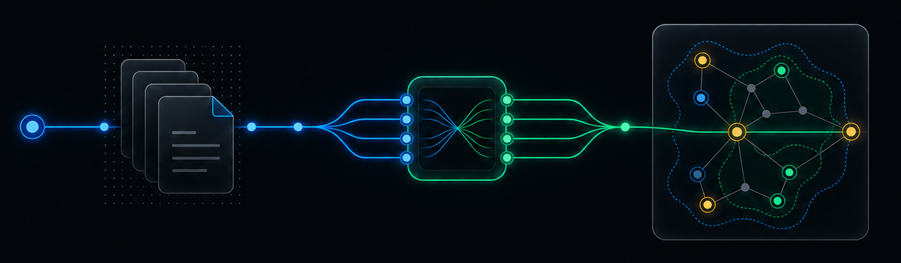
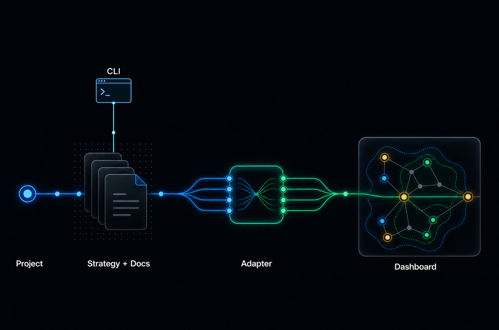
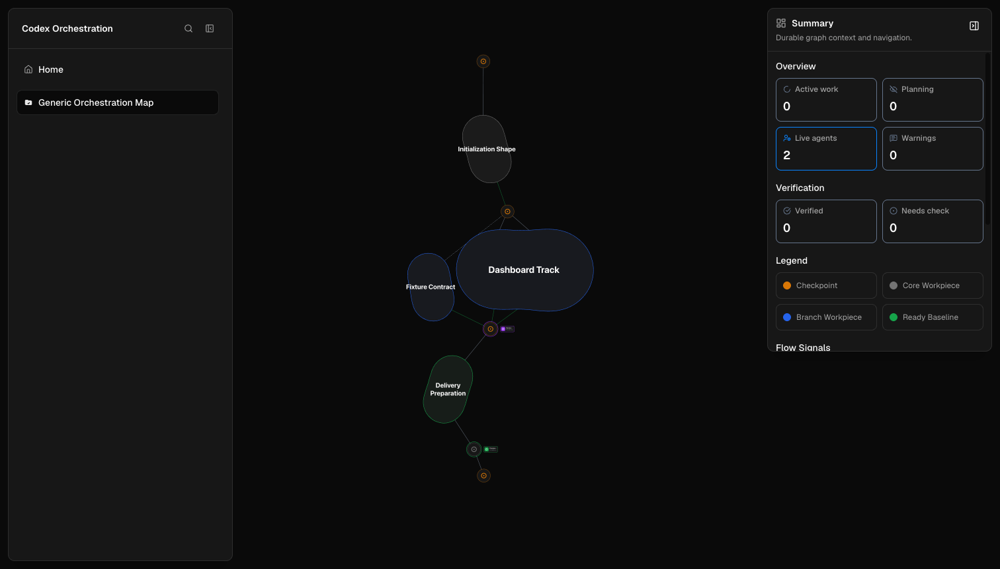
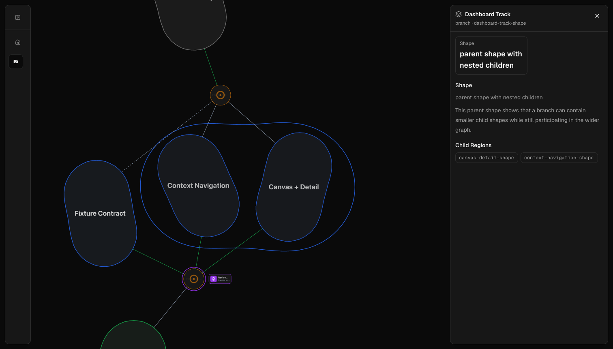
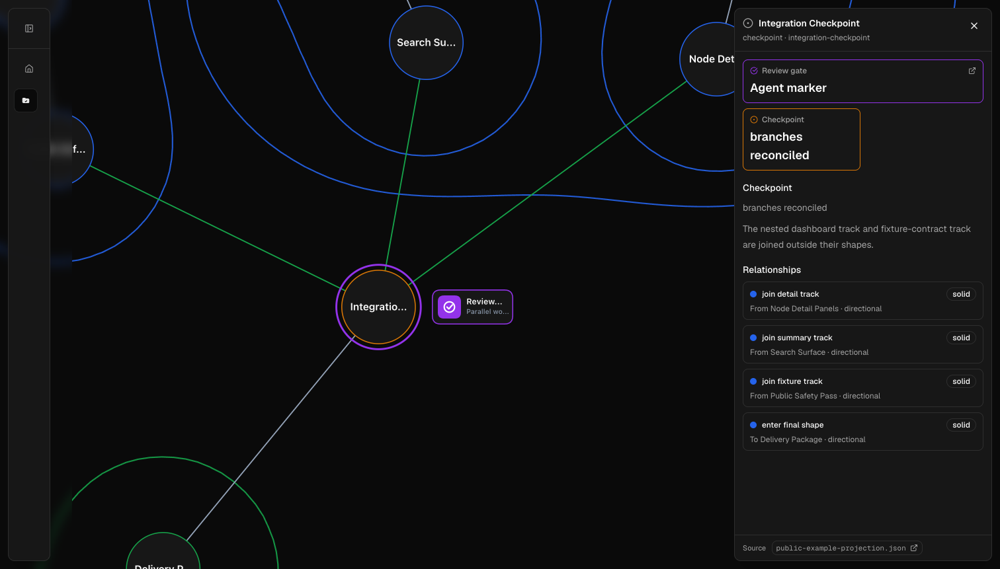

# Codex Orchestrator Dashboard



A local-first orchestration visualizer for Codex-heavy projects.

This is a personal/internal tool made public for visibility, reference, and
reuse. There is no formal contribution or support process yet.

## How It Works

The strategy is replaceable. The dashboard is reusable. The adapter is the
contract between them.

The point is to let each project evolve its own orchestration strategy without
making the visual layer obsolete every time. Strategy docs can change shape; the
adapter translates them into the stable dashboard model.



- **Strategy + Docs:** project-local Markdown under `.codex-orchestration/`.
- **Adapter:** strategy-specific interpretation into the dashboard graph shape.
- **Dashboard:** graph navigation, summaries, search, details, and project
  switching.
- **Context Command:** read-only `npm run orchestration-state` preflight for
  agents before acting.

Codex chat remains where work happens. The dashboard is only a visual sidecar
for durable orchestration docs.

## Public Preview

- Public preview: <https://codex-orchestrator-public-example.vercel.app>
- Source: <https://github.com/olafBobryk/codex-orchestrator-dashboard>







The public demo uses committed fixture data. It does not read a local project or
expose filesystem access, Codex runtime state, service controls, editor links,
or private project data.

## Quickstart

```bash
npm install
npm run dev
```

Open <http://localhost:3000>. The local app reads orchestration docs from:

```text
<project>/.codex-orchestration/
```

## Strategy Setup

Initialize the included shape strategy in another repo:

```bash
npm run init:shape-strategy -- /absolute/path/to/target-repo
```

Use `--force` only when intentionally replacing existing strategy state.

Refresh shared strategy support docs in an already-initialized repo:

```bash
npm run update:shape-strategy -- /absolute/path/to/target-repo
```

The update command preserves project-authored maps, shapes, workpieces, runs,
checkpoints, artifacts, and pressure ledger entries.

Install or refresh the read-only context command in a target repo:

```bash
npm run update:orchestration-cli -- /absolute/path/to/target-repo
```

`npm run orchestration-state` compresses the current orchestration root,
matched or candidate agent/run, current node or workpiece, read-next docs,
warnings, and identity confidence for agents before they act. It is a
lightweight context layer, not a lifecycle wrapper or replacement for the docs
or dashboard.

## Public Demo Mode

Public demo deployments should set:

```bash
NEXT_PUBLIC_DEMO=true
```

This keeps the deployment fixture-based instead of reading local project docs.

## Local Service

Run the dashboard as a local macOS service:

```bash
npm run service:install
npm run service:start
```

The service uses `http://127.0.0.1:26339`, writes runtime files under
`.codex/tmp/orchestrator-service/`, and can be managed with `service:stop`,
`service:restart`, `service:status`, `service:open`, and `service:uninstall`.

The always-on service runs `next start`; run `npm run build` after code changes
before restarting it.

Install a Spotlight-launchable local app wrapper:

```bash
npm run service:install-app
```

## Boundaries

- Plain Markdown docs are the durable V1 format.
- Markdown editing happens in VS Code.
- The dashboard visualizes orchestration docs; it does not execute work.
- No prompt generation, Codex chat replacement, agent tracker, or in-app editor.
- Public demo mode stays fixture-based and sanitized.

## Docs

- [docs/architecture.md](docs/architecture.md)

Agents: read [AGENTS.md](AGENTS.md) before working in this repo.
