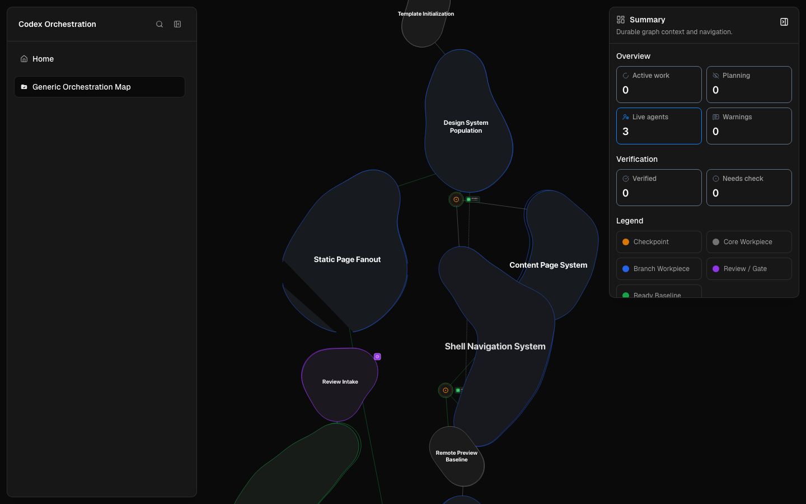
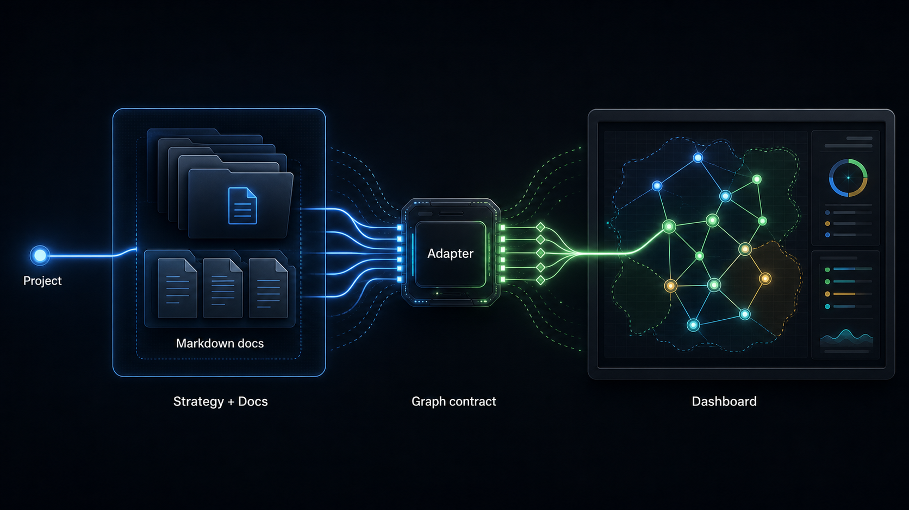

# Codex Orchestrator Dashboard



A local-first orchestration visualizer for Codex-heavy projects.

The important split is deliberate: the orchestration strategy and the dashboard
are separate products. The adapter is the link between them.

The strategy is replaceable. The dashboard is reusable. The adapter is the
contract between them.



## The Layered Model

**Orchestration Strategy:** project-local Markdown docs grouped by project and
strategy. The current included strategy is lightweight, Shape Up-inspired, and
still evolving as a documentation system.

**Adapter:** strategy-specific interpretation lives here. The adapter removes
strategy context, normalizes the docs, and maps them into the dashboard graph
contract.

**Dashboard:** an abstract visual layer for graph navigation, summaries, search,
detail panels, and project switching. It should stay useful even when the
underlying strategy changes.

## What This Can Do For You

Start with the included visual layer and current shape strategy. Use it as a
working baseline for seeing project strategy, handoffs, packet state, concerns,
gates, verification notes, and preview references as a navigable map.

From there, replace or fork the underlying strategy per project. The central
idea is not that every project should adopt one fixed doctrine; it is that each
project can plug a strategy into a shared visualizer by honoring the graph
contract.

Add custom UI panels only where a project strategy needs them. Keep generic
graph navigation, summaries, search, and project switching in the dashboard, and
push strategy-specific interpretation into adapters.

## Public Demo

The public demo is a hardcoded, sanitized fixture mode of the real dashboard app.
It exists to show the visual layer and graph contract without exposing local
filesystem access, Codex runtime state, service controls, editor links, or
private project data.

- Public demo: <https://codex-orchestrator-public-example.vercel.app>
- Source: <https://github.com/olafBobryk/codex-orchestrator-dashboard>

Public deployment should point at the root app with:

```bash
NEXT_PUBLIC_DEMO=true
```

The demo data is committed fixture data. It is not read from a local project at
runtime.

## Local Usage

Run the dashboard locally:

```bash
npm run dev
```

The local app reads project orchestration docs from:

```text
<project>/.codex-orchestration/
```

## Strategy Starter Commands

Initialize the current shape strategy in another repo:

```bash
npm run init:shape-strategy -- /absolute/path/to/target-repo
```

Use `--force` only when intentionally replacing existing shape strategy state.

The init command creates a clean project-local starter. It copies shared
`_guides/` and `_templates/` strategy docs, writes a blank map and pressure
ledger, and creates starter artifact/checkpoint/edge/run/shape/workpiece folders
at the root of `.codex-orchestration/`. It does not copy this repo's example
graph into the target.

Update an already-initialized repo with the latest shared strategy support docs:

```bash
npm run update:shape-strategy -- /absolute/path/to/target-repo
```

The update command refreshes shared `_guides/` and `_templates/` strategy docs
and creates a missing `pressure-ledger.md`. It preserves project-authored maps,
shapes, workpieces, runs, checkpoints, artifacts, and existing pressure ledger
entries. It updates only recognized shape strategy installs; ambiguous
`.codex-orchestration/` folders are left untouched.

## Local Service

Run the dashboard as a local macOS service:

```bash
npm run service:install
npm run service:start
```

The service uses `http://127.0.0.1:26339` by default. It is local-only, fails on
port conflict, writes runtime files under `.codex/tmp/orchestrator-service/`, and
can be managed with `service:stop`, `service:restart`, `service:status`,
`service:open`, and `service:uninstall`.

The always-on service runs `next start`; run `npm run build` after code changes
before restarting it.

Install a Spotlight-launchable local app wrapper:

```bash
npm run service:install-app
```

This creates `~/Applications/Codex Orchestration Dashboard.app`. Launching it
starts the service if needed and opens the Chrome app window.

## Boundaries

- Plain Markdown docs are the durable V1 format.
- Markdown editing happens in VS Code, opened to the selected Markdown file.
- The dashboard visualizes orchestration docs; it does not execute work.
- No prompt generation.
- No Codex chat replacement.
- No agent tracker or separate concern/gate workflow system.
- No in-app Markdown editor and no `/editor` route.
- Public demo mode stays fixture-based and sanitized.

## For Agents

Respect the local sidecar boundary. Do not turn the dashboard into an executor,
prompt generator, chat replacement, or private runtime reader.

Keep adapters responsible for strategy-specific interpretation. Keep the
dashboard focused on reusable graph navigation and review surfaces.

Keep public demo work hardcoded, sanitized, and safe for a public repository.

Read [AGENTS.md](AGENTS.md) before making changes.

## Useful Docs

- [docs/architecture.md](docs/architecture.md)
- [docs/implementation-plan.md](docs/implementation-plan.md)
- [docs/discussion-handoff.md](docs/discussion-handoff.md)
- [.codex-orchestration/strategies/shape-strategy/_guides/orchestration-shape-strategy.md](.codex-orchestration/strategies/shape-strategy/_guides/orchestration-shape-strategy.md)
- [.codex-orchestration/strategies/shape-strategy/_guides/artifacts/pressure-ledger.md](.codex-orchestration/strategies/shape-strategy/_guides/artifacts/pressure-ledger.md)
- [.codex-orchestration/strategies/shape-strategy/_templates/workpiece.md](.codex-orchestration/strategies/shape-strategy/_templates/workpiece.md)
- [.codex-orchestration/strategies/shape-strategy/pressure-ledger.md](.codex-orchestration/strategies/shape-strategy/pressure-ledger.md)
- [.codex-orchestration/strategies/shape-strategy/map.md](.codex-orchestration/strategies/shape-strategy/map.md)

This dashboard repo is the canonical strategy source, so it keeps strategy
material under `.codex-orchestration/strategies/shape-strategy/`. Normal target
projects initialized by the commands use root-level `.codex-orchestration/` docs
instead.
